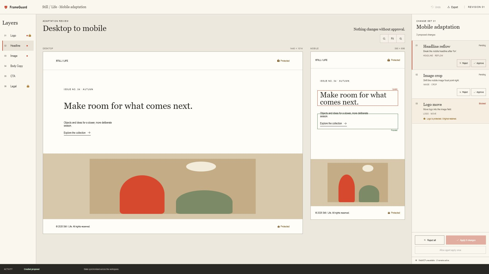

# FrameGuard

[](https://github.com/488315/frameguard/actions/workflows/ci.yml)
[](LICENSE)
[](https://github.com/488315/frameguard/releases/latest)
[](https://488315.github.io/frameguard/)

**Bounded visual change control for AI agents.**

Agents may propose. Policy constrains. Humans authorize. FrameGuard proves what changed.

FrameGuard lets a browser agent propose structured visual changes while a human compares the current and proposed designs, approves each eligible change, and sees protected elements blocked before anything is committed.

[Open the live demo](https://488315.github.io/frameguard/) · [Watch the 81-second demo](https://youtu.be/SdxH_-2y9j8) · [Read the architecture](docs/architecture.md)



## Why FrameGuard

Visual agents are useful for repetitive work such as adapting a campaign from desktop to mobile, revising page copy, or repositioning artwork. The risky part is the last mile: a plausible change can still violate a brand rule, alter legal text, or silently diverge from what the person watching expected.

FrameGuard turns that last mile into an explicit review workflow:

1. An agent inspects the visible document and submits a bounded proposal.
2. FrameGuard renders current and proposed layouts side by side.
3. Protected layers remain visible but cannot be approved or applied.
4. A person approves eligible changes one by one.
5. FrameGuard applies the approved set atomically, with undo and a downloadable review receipt.

The application runs entirely in the browser. Review data stays local and no application server is required.

### Recover an in-progress review

FrameGuard still starts empty by default. From the empty workspace or an active
review, enable **Recover in-progress reviews after refresh** to save the validated
active proposal and its decisions in this browser. Applying or rejecting the
proposal, resetting the workspace, or turning recovery off clears the saved draft.
You can also clear saved bytes without changing the current live review; FrameGuard
then labels that review unsaved until its next durable review change.

Recovery recreates the review through the same import, proposal, decision, and
protection boundaries used by the live application. Invalid or incompatible saved
data starts empty and reports recovery as unavailable. History, undo, selection,
activity, agent authorization, and composer text are never restored.

## Try the agent workflow

Open FrameGuard in a WebMCP-capable browser and give the agent this prompt:

> Inspect the FrameGuard document. Create a proposal titled “Mobile launch review” that changes the mobile headline to “Make room for the next chapter.”, moves the mobile image position to “72% center”, and attempts to change the protected Logo. Explain each change, then stop and wait for my approval.

The attempted logo edit appears in the review but remains blocked. Drafting, previewing, and approving do not alter the committed document. After approving at least one eligible change, select **Allow agent apply once** in FrameGuard, then ask the agent to apply the approved changes. That one-use authorization is consumed by the apply attempt. The agent can also undo an applied change set or return the review receipt when those operations are available.

## WebMCP tool surface

| Tool                     | Purpose                                                           |
| ------------------------ | ----------------------------------------------------------------- |
| `inspect_document`       | Read the committed document and active review state.              |
| `create_proposal`        | Submit an exact, bounded set of proposed visual changes.          |
| `inspect_proposal`       | Read policy, human-review, and application eligibility state.     |
| `revise_proposal`        | Replace an active proposal before human review begins.            |
| `withdraw_proposal`      | Withdraw an uncommitted agent proposal without document mutation. |
| `apply_approved_changes` | Atomically commit only the approved changes.                      |
| `undo_last_change_set`   | Restore the previous committed document.                          |
| `export_review_receipt`  | Return a local record of the completed review.                    |

Tool registrations and schemas are generated from current application state. Creation tools are absent during an active review, undo and export appear only when their prerequisites exist, and apply appears only after one-use human authorization. Approval and rejection remain human UI actions; no WebMCP tool can promote agent authority. Each authorization is bound to one proposal, base revision, and exact approved change set, and its consumption is recorded in the committed receipt. Agent actions and human actions use the same store and validation path, keeping the visible UI synchronized with the underlying review state. Tool outputs that can contain imported or user-authored content are marked as untrusted for the browser agent.

## Run locally

```sh
npm install
npm run dev
```

Run `npm test` for the unit and component suite, `npm run test:e2e` for the real browser workflow, and `npm run build` for a production build.

### Enable WebMCP in Chrome

1. Use Chrome 149 or newer.
2. Open `chrome://flags/#enable-webmcp-testing`, enable WebMCP testing, and relaunch Chrome.
3. Start FrameGuard with `npm run dev -- --host 127.0.0.1`.
4. Open the printed local URL in the WebMCP-enabled Chrome profile.

FrameGuard remains fully usable when WebMCP is unavailable and reports that state in the review drawer. It never claims registration succeeded unless Chrome accepts the tool registrations.

## Safety and implementation

FrameGuard starts empty. A validated import or explicit proposal provisions the starter workspace; no hidden sample state is committed at startup. Protected elements and committed canvas state remain under human control, invalid proposals fail without partial mutation, and undo restores the last committed document.

- [Architecture and invariants](docs/architecture.md)
- [Deterministic evaluation cases](docs/evaluations.md)
- [Contribution guide](CONTRIBUTING.md)

## Quality gates

```sh
npm run format
npm run lint
npm test
npm run test:evals
npm run build
npm run test:e2e
```
